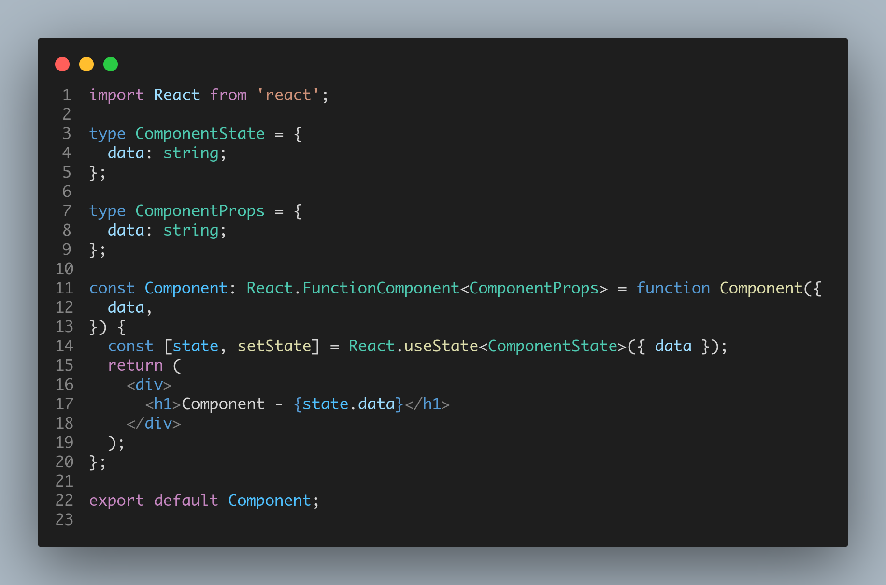

# React snips 
A simplistic featured snippet genertor for vscode react functional components

A sample functional component here

This provides props and types for functional components out of the box

### Shortcuts
`rndft - React snippet for typescript component` 

# Enjoy